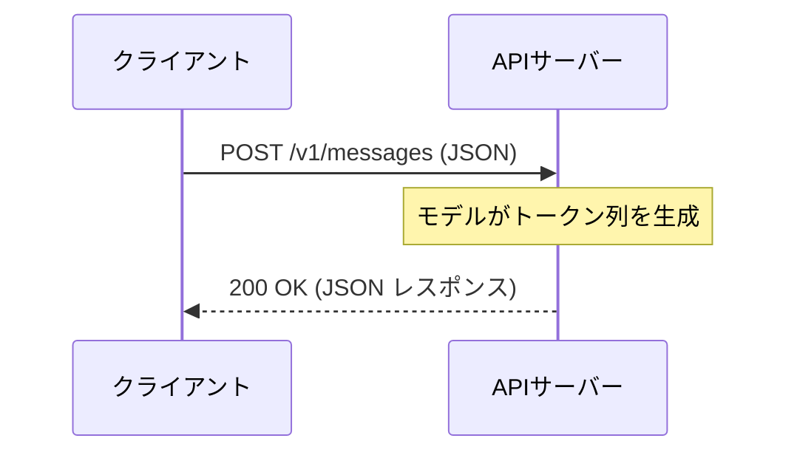

# APIの基本仕組み

## この教材で身につくこと

- LLM APIの基本的なリクエスト/レスポンス構造
- ステートレス設計の意味と会話履歴の扱い方
- ストリーミングとの違い（非ストリーミング応答）

## 概要

LLM APIの中心は、単一のHTTPSエンドポイントに対する
`POST`リクエストです（例: `POST /v1/messages`）。
クライアントがJSONを送り、モデルが生成したテキストをJSONで返します。

## 位置づけ

02章（Core Mechanics）で扱うメッセージ形式・ストリーミングの前提となる
最も基礎的な通信の仕組みです。

## 仕組み解説

### 基本フロー



### 必須ヘッダー

| ヘッダー | 役割 |
|----------|------|
| `Content-Type: application/json` | 送信データがJSONであることを示す |
| `x-api-key` または `Authorization` | 認証情報（詳細は04教材） |
| `anthropic-version` 等 | APIバージョン指定（ベンダー依存） |

### ステートレス設計

APIサーバーは会話の状態を保持しません。
2ターン目以降も、**それまでの会話履歴全体**を毎回送信する必要があります。

```json
// ✅ 良い例: 会話履歴を毎回すべて含める
{
  "messages": [
    {"role": "user", "content": "私の名前はAliceです"},
    {"role": "assistant", "content": "こんにちはAliceさん"},
    {"role": "user", "content": "私の名前は？"}
  ]
}
```

```json
// ❌ 悪い例: 最新の発話だけを送ると文脈が失われる
{
  "messages": [
    {"role": "user", "content": "私の名前は？"}
  ]
}
```

## 実装例

### Claude API

```bash
curl https://api.anthropic.com/v1/messages \
  -H "Content-Type: application/json" \
  -H "x-api-key: $ANTHROPIC_API_KEY" \
  -H "anthropic-version: 2023-06-01" \
  -d '{
    "model": "claude-opus-4-8",
    "max_tokens": 1024,
    "messages": [{"role": "user", "content": "こんにちは"}]
  }'
```

```python
import anthropic

client = anthropic.Anthropic()  # ANTHROPIC_API_KEY 環境変数を利用
response = client.messages.create(
    model="claude-opus-4-8",
    max_tokens=1024,
    messages=[{"role": "user", "content": "こんにちは"}],
)
print(response.content[0].text)
```

### OpenAI公式API

```bash
curl https://api.openai.com/v1/chat/completions \
  -H "Content-Type: application/json" \
  -H "Authorization: Bearer $OPENAI_API_KEY" \
  -d '{
    "model": "gpt-4o",
    "messages": [{"role": "user", "content": "こんにちは"}]
  }'
```

```python
from openai import OpenAI

client = OpenAI()  # OPENAI_API_KEY 環境変数を利用
response = client.chat.completions.create(
    model="gpt-4o",
    messages=[{"role": "user", "content": "こんにちは"}],
)
print(response.choices[0].message.content)
```

> 対応表: 認証ヘッダーは`x-api-key`（Claude） vs `Authorization: Bearer`（OpenAI）。
> 応答テキストは`content[0].text`（Claude） vs `choices[0].message.content`（OpenAI）。

## 演習課題

1. 3ターンの会話（自己紹介→質問→回答確認）を送るJSONを書け
2. なぜAPIサーバーが会話状態を保持しない設計になっているか、利点を1つ挙げよ
3. Claude APIとOpenAI公式APIで、応答テキストを取り出すコードがどう違うか説明せよ

## 理解度チェック

- [ ] リクエストとレスポンスの基本的なJSON構造を説明できる
- [ ] ステートレス設計の意味と、クライアント側の責務を説明できる
- [ ] 認証ヘッダーとバージョンヘッダーの役割の違いを言える
- [ ] Claude APIとOpenAI公式APIの認証ヘッダー形式の違いを説明できる

---
前へ: [01-history-of-llm-api.md](01-history-of-llm-api.md) | 次へ: [03-tokens-and-context.md](03-tokens-and-context.md)
