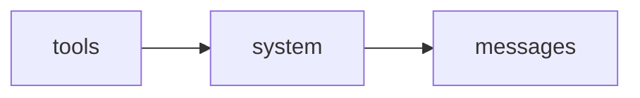

# プロンプトキャッシュ

## この教材で身につくこと

- プロンプトキャッシュがプレフィックス一致で動く仕組み
- キャッシュを効かせるためのプロンプト設計原則
- キャッシュヒット率を検証する方法

## 概要

プロンプトキャッシュは、同じ内容が繰り返し送られる部分
（システムプロンプト・ツール定義など）をサーバー側でキャッシュし、
処理コストと料金を削減する仕組みです。

## 位置づけ

01章のトークン・コストの知識と、02章のメッセージ構造の理解を
組み合わせて実践する、コスト最適化の中心技術です。

## 仕組み解説

### 最重要ルール: プレフィックス一致

キャッシュは「先頭からの完全一致」で判定されます。
プレフィックスのどこか1バイトでも変わると、それ以降すべて
キャッシュが無効になります。



### キャッシュを壊す典型パターン

| パターン | 問題点 |
|----------|--------|
| systemプロンプトに現在時刻を埋め込む | 毎回プレフィックスが変わり全キャッシュ無効化 |
| JSON生成時にキーの順序が不定 | バイト列が毎回変わる |
| ツール定義の順序を毎回変える | tools部分のキャッシュが効かない |

```python
# ❌ 悪い例: 現在時刻をsystemに直接埋め込む
system = f"現在時刻: {datetime.now()}\nあなたは丁寧なアシスタントです。"
```

```python
# ✅ 良い例: 可変情報は最後のuserメッセージに入れる
system = "あなたは丁寧なアシスタントです。"
messages = [{"role": "user", "content": f"[時刻: {now}] {user_input}"}]
```

### 経済性の目安

| 種別 | コスト倍率（目安） |
|------|---------------------|
| キャッシュ書き込み（5分TTL） | 通常入力の約1.25倍 |
| キャッシュ書き込み（1時間TTL） | 通常入力の約2倍 |
| キャッシュ読み込み | 通常入力の約0.1倍 |

### OpenAIの自動プロンプトキャッシュとの違い

OpenAI公式APIは`cache_control`のような明示的な指定が不要で、
一定長以上のプロンプトに対して自動的にキャッシュが適用される。
キャッシュヒット状況はレスポンスの`usage.prompt_tokens_details`配下
（`cached_tokens`等）で確認する。具体的なフィールド名・閾値は
モデル・時期により変わるため公式ドキュメントで確認すること。

## 実装例

### Claude API

```json
{
  "model": "claude-opus-4-8",
  "max_tokens": 1024,
  "system": [
    {"type": "text", "text": "<長い共通システムプロンプト>", "cache_control": {"type": "ephemeral"}}
  ],
  "messages": [{"role": "user", "content": "今日の質問はこちらです"}]
}
```

```python
# キャッシュヒットの検証
print(response.usage.cache_creation_input_tokens)  # 書き込みトークン数
print(response.usage.cache_read_input_tokens)      # 読み込みトークン数

if response.usage.cache_read_input_tokens == 0:
    print("キャッシュが効いていない可能性 -> プレフィックスの揺れを確認")
```

### OpenAI公式API

```python
# cache_controlのような指定は不要。同じ先頭プレフィックスを
# 繰り返すだけで自動的にキャッシュが適用される。
response = client.chat.completions.create(
    model="gpt-4o",
    messages=[
        {"role": "system", "content": "<長い共通システムプロンプト>"},
        {"role": "user", "content": "今日の質問はこちらです"},
    ],
)
# キャッシュヒット状況はusageの詳細フィールドで確認する
# （フィールド名は公式ドキュメントで確認すること）
print(response.usage)
```

> 対応表: Claudeは`cache_control`を明示指定する必要があるが、
> OpenAIは指定不要で自動適用される。可視化されるレスポンスの
> フィールド名は両者で異なる。

## 演習課題

1. システムプロンプトにユーザーIDを埋め込むとキャッシュにどう影響するか説明せよ
2. `cache_creation_input_tokens`は増えるが`cache_read_input_tokens`が
   常に0になる場合、まず疑うべき原因を1つ挙げよ
3. Claude APIとOpenAI公式APIで、キャッシュを有効にする方法（明示指定 vs 自動）の違いを説明せよ

## 理解度チェック

- [ ] プレフィックス一致というキャッシュの基本原理を説明できる
- [ ] キャッシュを壊す典型的なアンチパターンを挙げられる
- [ ] `usage`フィールドからキャッシュヒット状況を検証できる
- [ ] Claude APIとOpenAI公式APIのキャッシュ適用方式（手動/自動）の違いを説明できる

---
前へ: [02-extended-thinking.md](02-extended-thinking.md) | 次へ: [04-structured-outputs.md](04-structured-outputs.md)
