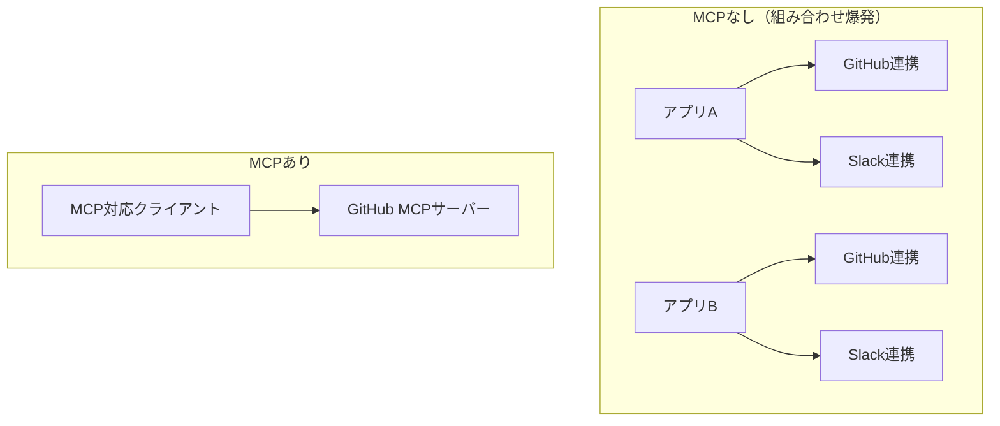

# MCP (Model Context Protocol)

## この教材で身につくこと

- MCPが解決する「ツール接続のN×M問題」
- MCPサーバー/クライアントの基本的な役割分担
- 02章のツール呼び出しとの違い

## 概要

MCP（Model Context Protocol）は、LLMアプリケーションが外部ツールや
データソースに接続する方法を標準化するオープンプロトコルです。
「USBのような共通の差し込み口」を目指して設計されています。

## 位置づけ

02章で学んだツール呼び出しは「1つのAPI呼び出し内で完結する」
仕組みでした。MCPはそれをアプリケーション横断で再利用可能にする
一段上のレイヤーです。

## 仕組み解説

### MCPが解決する問題

MCP登場以前は、ツール（GitHub、Slack、DBなど）ごとに
各LLMアプリが個別の連携コードを書く必要がありました
（N個のアプリ × M個のツール = N×M通りの実装）。



### 役割分担

| 役割 | 説明 |
|------|------|
| MCPサーバー | ツール・データソースを標準プロトコルで公開する側 |
| MCPクライアント（ホストアプリ） | LLMアプリ側でMCPサーバーに接続し、ツールとして利用する側 |
| ツール/リソース/プロンプト | MCPサーバーが提供する3種類の機能単位 |

### 02章のツール呼び出しとの違い

| 比較項目 | 通常のツール呼び出し | MCP |
|----------|----------------------|-----|
| 定義の再利用性 | アプリごとに個別定義 | サーバー1つで複数アプリから共用 |
| 接続範囲 | 1つのAPIリクエスト内 | 複数アプリ・複数セッションで永続化可能 |
| 標準化レベル | ベンダーごとのJSON Schema形式 | プロトコルレベルで統一 |

```json
// MCPサーバー宣言（Anthropic API上でのMCPコネクタの例）
{
  "mcp_servers": [{"type": "url", "name": "github", "url": "https://api.githubcopilot.com/mcp/"}],
  "tools": [{"type": "mcp_toolset", "mcp_server_name": "github"}]
}
```

## 実装例

```bash
# MCPサーバーへの接続を含むリクエスト（概念例）
curl https://api.anthropic.com/v1/messages \
  -H "x-api-key: $ANTHROPIC_API_KEY" \
  -H "anthropic-version: 2023-06-01" \
  -H "anthropic-beta: mcp-client-2025-11-20" \
  -H "Content-Type: application/json" \
  -d '{
    "model": "claude-opus-4-8",
    "max_tokens": 1024,
    "mcp_servers": [{"type": "url", "url": "https://example/mcp", "name": "example-mcp"}],
    "tools": [{"type": "mcp_toolset", "mcp_server_name": "example-mcp"}],
    "messages": [{"role": "user", "content": "リポジトリのissue一覧を見せて"}]
  }'
```

### 業界横断での採用状況

MCPはAnthropicが公開したプロトコルだが、特定ベンダー専用の仕組みではない。
OpenAIのエージェント向けツール群を含め、業界横断で採用が広がっている。
「標準化」とは、1社の独占ではなく複数ベンダーが同じ仕様に乗ることを指す
好例といえる。

## 演習課題

1. MCPが無い場合に発生する「組み合わせ爆発」を具体例で説明せよ
2. MCPサーバーとMCPクライアントの役割の違いを説明せよ
3. MCPがAnthropic発でありながら業界横断で採用されている意義を説明せよ

## 理解度チェック

- [ ] MCPが解決するN×M問題を説明できる
- [ ] MCPサーバー/クライアントの役割分担を理解している
- [ ] 通常のツール呼び出しとMCPの再利用性の違いを説明できる
- [ ] MCPが特定ベンダー専用ではなく業界横断の標準である点を説明できる

---
前へ: [01-openai-compatible-api.md](01-openai-compatible-api.md) | 次へ: [03-error-handling-and-versioning.md](03-error-handling-and-versioning.md)
