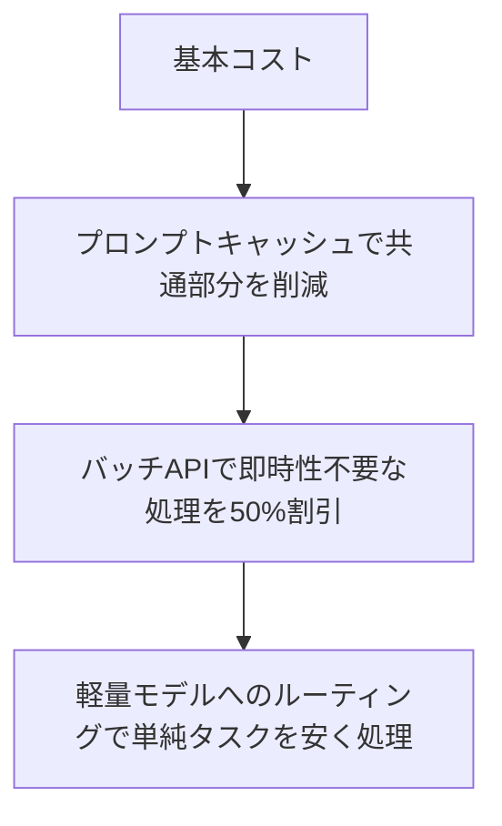

# コストとプロバイダ比較

## この教材で身につくこと

- モデル選定によるコスト・品質トレードオフの考え方
- プロンプトキャッシュ・バッチAPIによるコスト削減の組み合わせ
- 複数プロバイダを使い分ける設計パターン

## 概要

これまでの全カテゴリの知識を使い、
「どのモデルを・どう呼ぶか」を実務的に判断する視点を身につけます。

## 位置づけ

このチュートリアルの最終教材です。
01章（経緯）〜04章（標準化）の理解を、意思決定に活かします。

## 仕組み解説

### モデル選定の考え方

| タスクの性質 | 推奨する方向性 |
|--------------|----------------|
| 高精度が必要（複雑な推論・コーディング） | 上位モデル + 高いeffort |
| 高速・大量処理（分類、要約） | 軽量モデル + 低いeffort |
| コスト重視のバッチ処理 | バッチAPI（非同期・約50%割引） |
| 何度も同じ文脈を問い合わせる | プロンプトキャッシュを併用 |

### コスト削減手法の組み合わせ



```python
# ✅ 良い例: タスクの難易度に応じてモデルを使い分ける
def classify_simple(text: str) -> str:
    return client.messages.create(
        model="claude-haiku-4-5", max_tokens=10,
        messages=[{"role": "user", "content": f"positive/negative/neutralで分類: {text}"}],
    ).content[0].text

def analyze_complex(text: str) -> str:
    return client.messages.create(
        model="claude-opus-4-8", max_tokens=4000,
        output_config={"effort": "high"},
        messages=[{"role": "user", "content": f"詳細分析: {text}"}],
    ).content[0].text
```

```python
# ❌ 悪い例: すべてのタスクに最上位モデルを使い、コストを圧迫する
def classify_simple(text: str) -> str:
    return client.messages.create(
        model="claude-opus-4-8", max_tokens=4000,
        output_config={"effort": "max"},
        messages=[{"role": "user", "content": f"positive/negative/neutralで分類: {text}"}],
    ).content[0].text
```

### プロバイダを使い分ける設計

04章で学んだOpenAI互換API・MCPの知識を活かし、
抽象化レイヤー（LiteLLM等）を挟むことで、
プロバイダ変更時の影響範囲を局所化できます。

## 実装例

### Claude API

```python
# 事前にトークン数を見積もり、コストを試算する
count = client.messages.count_tokens(
    model="claude-opus-4-8",
    messages=[{"role": "user", "content": long_document}],
)
estimated_cost = count.input_tokens * 3 / 1_000_000  # $3/1Mトークンの例
print(f"推定コスト: ${estimated_cost:.4f}")
```

```python
# バッチAPIで大量の分類タスクを50%割引で処理する例
batch = client.messages.batches.create(requests=[
    {"custom_id": f"item-{i}", "params": {
        "model": "claude-haiku-4-5", "max_tokens": 10,
        "messages": [{"role": "user", "content": text}],
    }}
    for i, text in enumerate(items)
])

# ポーリングして完了を待つ（バッチは非同期。数分〜最大24時間かかる）
import time

while True:
    batch = client.messages.batches.retrieve(batch.id)
    if batch.processing_status == "ended":
        break
    time.sleep(30)

# 結果を取得する（custom_idで元のリクエストと対応づける）
results = {}
for result in client.messages.batches.results(batch.id):
    if result.result.type == "succeeded":
        results[result.custom_id] = result.result.message.content[0].text
    else:
        results[result.custom_id] = f"エラー: {result.result.type}"
```

### OpenAI公式API

```python
# tiktokenでトークン数を見積もる（単価は公式サイトの最新情報を参照）
import tiktoken

encoding = tiktoken.encoding_for_model("gpt-4o")
token_count = len(encoding.encode(long_document))
print(f"推定トークン数: {token_count}")
# 単価は変動するため、コスト計算は公式の料金ページを都度参照する
```

```python
# バッチAPIは、まずJSONL形式のリクエストファイルをアップロードする
import json
import time

with open("batch_requests.jsonl", "w") as f:
    for i, text in enumerate(items):
        f.write(json.dumps({
            "custom_id": f"item-{i}",
            "method": "POST",
            "url": "/v1/chat/completions",
            "body": {
                "model": "gpt-4o-mini", "max_tokens": 10,
                "messages": [{"role": "user", "content": text}],
            },
        }) + "\n")

uploaded = client.files.create(file=open("batch_requests.jsonl", "rb"), purpose="batch")
batch = client.batches.create(
    input_file_id=uploaded.id,
    endpoint="/v1/chat/completions",
    completion_window="24h",
)

# ポーリングして完了を待つ
while True:
    batch = client.batches.retrieve(batch.id)
    if batch.status == "completed":
        break
    time.sleep(30)

# 出力ファイルをダウンロードし、1行1リクエストのJSONLを読む
output = client.files.content(batch.output_file_id).text
results = {}
for line in output.splitlines():
    entry = json.loads(line)
    results[entry["custom_id"]] = entry["response"]["body"]["choices"][0]["message"]["content"]
```

> 対応表: Claudeは`count_tokens` API呼び出し、OpenAIは`tiktoken`の
> ローカル実行でトークン数を見積もる。具体的な単価は両社とも
> 変動するため、コスト計算式に固定値を埋め込まず都度確認する。
> バッチAPIも構造が異なり、Claudeはリクエストを直接JSONで渡すが、
> OpenAIはJSONLファイルをFiles APIにアップロードしてから参照する。

## 演習課題

1. 「大量の商品レビュー分類」と「1件の複雑な契約書レビュー」で、
   それぞれ適したモデル・機能の組み合わせを提案せよ
2. プロンプトキャッシュとバッチAPIを併用できない/しにくい場面を考えよ
3. Claude APIとOpenAI公式APIで、事前のトークン数見積もり方法の違いを説明せよ
4. Claude APIとOpenAI公式APIで、バッチリクエストを渡す方法（直接JSON vs
   ファイルアップロード）の違いを説明せよ

## 理解度チェック

- [ ] タスクの性質に応じたモデル選定ができる
- [ ] キャッシュ・バッチAPI・モデル選定を組み合わせて説明できる
- [ ] プロバイダ変更の影響を抽象化レイヤーで局所化する発想を理解している
- [ ] Claude APIとOpenAI公式APIのトークン見積もり方法の違いを説明できる
- [ ] バッチAPIの作成→ポーリング→結果取得という一連の流れを実装できる

---
前へ: [02-tool-calling-agent.md](02-tool-calling-agent.md) | [目次に戻る](../../MASTER-INDEX.md)
