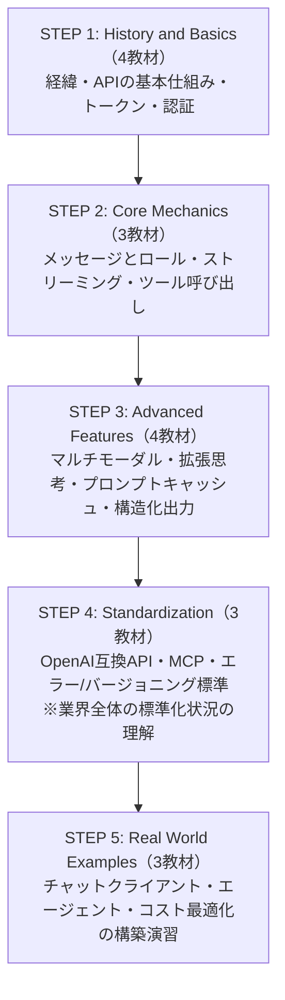
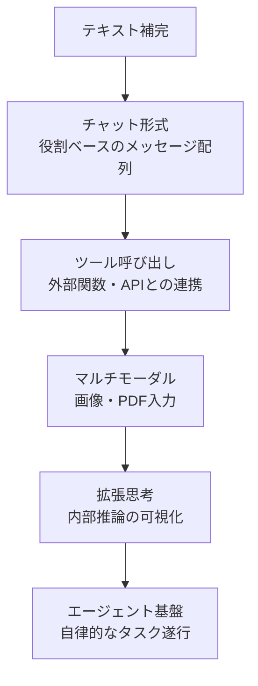
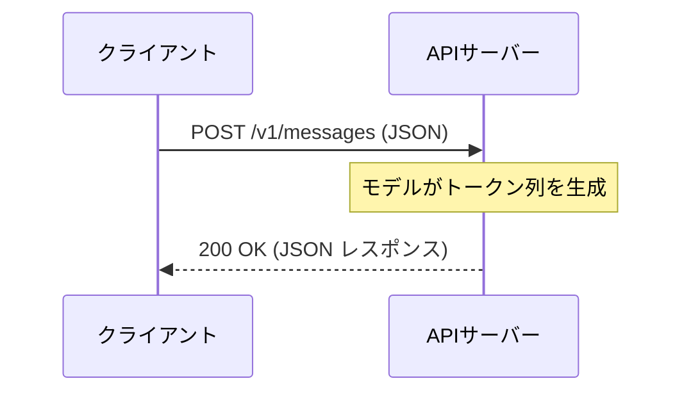
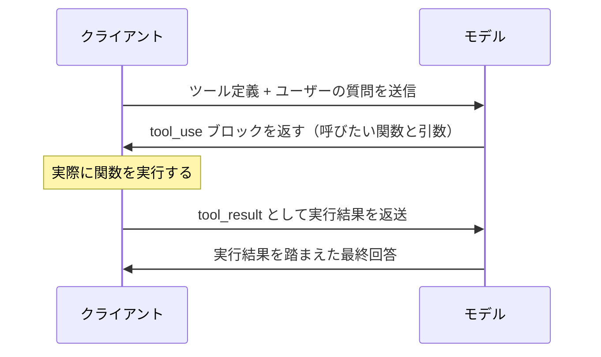
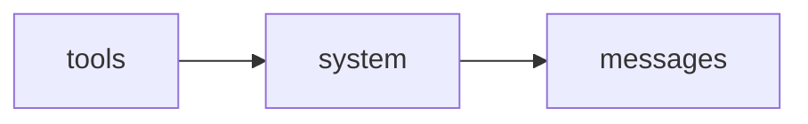
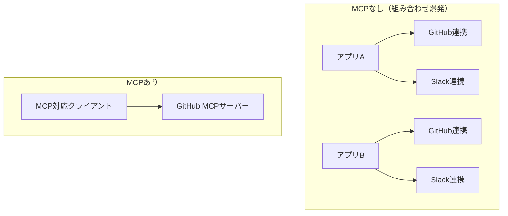
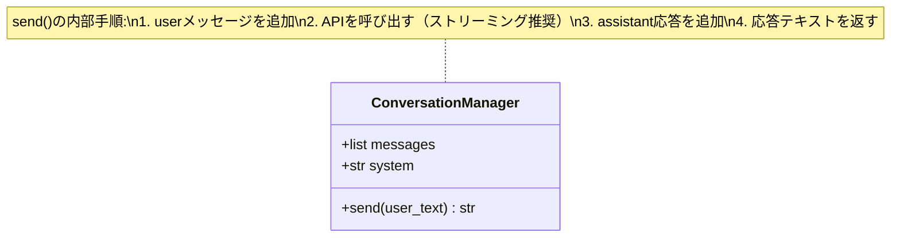
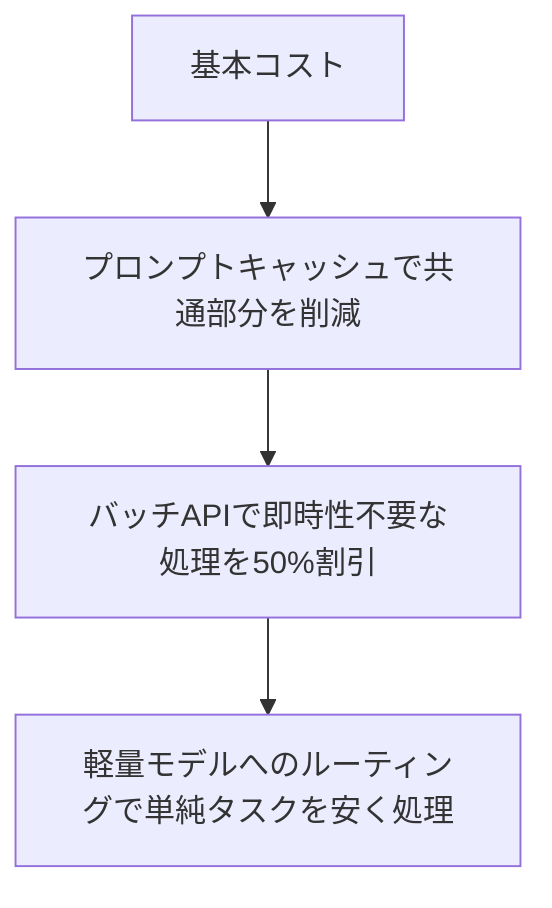

# Mermaid Diagram Conversion Implementation Plan

> **For agentic workers:** REQUIRED SUB-SKILL: Use superpowers:subagent-driven-development (recommended) or superpowers:executing-plans to implement this plan task-by-task. Steps use checkbox (`- [ ]`) syntax for tracking.

**Goal:** Replace all 8 existing ASCII-art diagrams in `llm-api-tutorial` with GitHub-native Mermaid diagrams, and add a style-guide rule so future diagrams default to Mermaid.

**Architecture:** Documentation-only change set. Each task replaces one plain (unlabeled) code-fenced ASCII diagram with an equivalent ```mermaid``` code block of the type specified in the design spec (`flowchart`, `sequenceDiagram`, or `classDiagram`), preserving every piece of information the original ASCII diagram conveyed — no new content is introduced. Three of the nine target snippets already have validated Mermaid syntax from a visual-companion session earlier in this conversation; use that syntax verbatim.

**Tech Stack:** Markdown, GitHub-native Mermaid rendering (no build tooling, no ebook-build pipeline). Reference spec: `docs/superpowers/specs/2026-07-19-mermaid-diagram-conversion-design.md`.

## Global Constraints

- Use only Mermaid diagram types GitHub renders natively: `flowchart`, `sequenceDiagram`, `classDiagram`. No plugin-only syntax.
- Preserve every node label's original text content. Do not add information that wasn't in the source ASCII diagram.
- Node label line breaks use `<br/>` only (the syntax validated via the visual companion for diagrams #2, #3, #7 below).
- Do not touch `docs/superpowers/specs/` or `docs/superpowers/plans/` (historical records) or any category `00-README.md`'s "01 → 03 の順に進める" one-line arrow text (not a diagram).
- Every file edit gives the exact `old_string` (copied from the file as read in this plan) and exact `new_string`. Apply with the Edit tool exactly as written.
- After each edit, run the verification `grep` command given in that task before moving on.
- One commit per task.

---

### Task 1: 00_STYLE_GUIDE.md — add the Mermaid-first rule

**Files:**
- Modify: `00_STYLE_GUIDE.md`

- [ ] **Step 1: Add two bullets to "4. コードブロックルール"**

old_string:
````markdown
## 4. コードブロックルール

- 言語指定を必ず付ける（`bash`, `python`, `json`, `javascript`）
- コピペ可能な最小セットに絞る
- 実在しないAPIパラメータ名・エンドポイントを記載しない
- コードブロック内は1行90文字以内を目安にする
- APIキーはハードコードせず環境変数で参照する例に統一する
````

new_string:
````markdown
## 4. コードブロックルール

- 言語指定を必ず付ける（`bash`, `python`, `json`, `javascript`）
- コピペ可能な最小セットに絞る
- 実在しないAPIパラメータ名・エンドポイントを記載しない
- コードブロック内は1行90文字以内を目安にする
- APIキーはハードコードせず環境変数で参照する例に統一する
- 図解が必要な場合はMermaid形式（```mermaid` ブロック）を優先する。
  ASCIIアートの罫線・矢印による自作図は使わない
- Mermaidのテーマ・色は指定せず、GitHub既定のレンダリングに任せる
````

- [ ] **Step 2: Verify**

Run: `grep -c "Mermaid形式" 00_STYLE_GUIDE.md`
Expected: `1`

- [ ] **Step 3: Commit**

```bash
git add 00_STYLE_GUIDE.md
git commit -m "docs: add Mermaid-first rule to style guide"
```

---

### Task 2: docs/00-COVER.md — STEP 1〜5 flowchart

**Files:**
- Modify: `docs/00-COVER.md`

- [ ] **Step 1: Replace the STEP flow ASCII block with a Mermaid flowchart**

old_string:
````markdown
## 学習の流れ

```
STEP 1 ──→ History and Basics（4教材）
             経緯・APIの基本仕組み・トークン・認証

STEP 2 ──→ Core Mechanics（3教材）
             メッセージとロール・ストリーミング・ツール呼び出し

STEP 3 ──→ Advanced Features（4教材）
             マルチモーダル・拡張思考・プロンプトキャッシュ・構造化出力

STEP 4 ──→ Standardization（3教材）
             OpenAI互換API・MCP・エラー/バージョニング標準
              ※ 業界全体の標準化状況の理解

STEP 5 ──→ Real World Examples（3教材）
             チャットクライアント・エージェント・コスト最適化の構築演習
```

## 前提知識
````

new_string:
````markdown
## 学習の流れ



## 前提知識
````

- [ ] **Step 2: Verify**

Run: `grep -c '```mermaid' docs/00-COVER.md`
Expected: `1`

Run: `grep -c '──→' docs/00-COVER.md`
Expected: `0`

- [ ] **Step 3: Commit**

```bash
git add docs/00-COVER.md
git commit -m "docs: convert STEP flow diagram to Mermaid in 00-COVER.md"
```

---

### Task 3: 01-history-of-llm-api.md — feature-expansion flowchart

**Files:**
- Modify: `docs/01-history-and-basics/01-history-of-llm-api.md`

**Note:** This exact Mermaid syntax was rendered and approved via the visual companion earlier in this session — use it verbatim, do not re-derive.

- [ ] **Step 1: Replace the ASCII arrow chain with the validated Mermaid flowchart**

old_string:
````markdown
```
テキスト補完
  → チャット形式（役割ベースのメッセージ配列）
    → ツール呼び出し（外部関数・APIとの連携）
      → マルチモーダル（画像・PDF入力）
        → 拡張思考（内部推論の可視化）
          → エージェント基盤（自律的なタスク遂行）
```
````

new_string:
````markdown

````

- [ ] **Step 2: Verify**

Run: `grep -c '```mermaid' docs/01-history-and-basics/01-history-of-llm-api.md`
Expected: `1`

Run: `grep -c '  → チャット形式' docs/01-history-and-basics/01-history-of-llm-api.md`
Expected: `0`

- [ ] **Step 3: Commit**

```bash
git add docs/01-history-and-basics/01-history-of-llm-api.md
git commit -m "docs: convert feature-expansion diagram to Mermaid flowchart"
```

---

### Task 4: 02-api-fundamentals.md — client/server sequence diagram

**Files:**
- Modify: `docs/01-history-and-basics/02-api-fundamentals.md`

**Note:** This exact Mermaid syntax was rendered and approved via the visual companion earlier in this session — use it verbatim, do not re-derive.

- [ ] **Step 1: Replace the ASCII box diagram with the validated Mermaid sequence diagram**

old_string:
````markdown
```
クライアント                         APIサーバー
    │  POST /v1/messages (JSON)          │
    │ ───────────────────────────────→   │
    │                                     │  モデルが
    │                                     │  トークン列を生成
    │  ←─────────────────────────────    │
    │  200 OK (JSON レスポンス)           │
```
````

new_string:
````markdown

````

- [ ] **Step 2: Verify**

Run: `grep -c '```mermaid' docs/01-history-and-basics/02-api-fundamentals.md`
Expected: `1`

Run: `grep -c '───────────────────────────────→' docs/01-history-and-basics/02-api-fundamentals.md`
Expected: `0`

- [ ] **Step 3: Commit**

```bash
git add docs/01-history-and-basics/02-api-fundamentals.md
git commit -m "docs: convert client/server flow diagram to Mermaid sequence diagram"
```

---

### Task 5: 03-tool-use.md — 5-step round-trip sequence diagram

**Files:**
- Modify: `docs/02-core-mechanics/03-tool-use.md`

- [ ] **Step 1: Replace the numbered round-trip list with a Mermaid sequence diagram**

old_string:
````markdown
```
1. クライアント → モデル: ツール定義 + ユーザーの質問を送信
2. モデル → クライアント: tool_use ブロックを返す（呼びたい関数と引数）
3. クライアント: 実際に関数を実行する
4. クライアント → モデル: tool_result として実行結果を返送
5. モデル → クライアント: 実行結果を踏まえた最終回答
```
````

new_string:
````markdown

````

- [ ] **Step 2: Verify**

Run: `grep -c '```mermaid' docs/02-core-mechanics/03-tool-use.md`
Expected: `1`

Run: `grep -c '^1\. クライアント → モデル'  docs/02-core-mechanics/03-tool-use.md`
Expected: `0`

- [ ] **Step 3: Commit**

```bash
git add docs/02-core-mechanics/03-tool-use.md
git commit -m "docs: convert tool-use round-trip diagram to Mermaid sequence diagram"
```

---

### Task 6: 03-prompt-caching.md — render-order flowchart

**Files:**
- Modify: `docs/03-advanced-features/03-prompt-caching.md`

- [ ] **Step 1: Replace the one-line render-order diagram with a minimal Mermaid flowchart**

old_string:
````markdown
```
レンダー順序: tools → system → messages
```
````

new_string:
````markdown

````

- [ ] **Step 2: Verify**

Run: `grep -c '```mermaid' docs/03-advanced-features/03-prompt-caching.md`
Expected: `1`

Run: `grep -c 'レンダー順序: tools' docs/03-advanced-features/03-prompt-caching.md`
Expected: `0`

- [ ] **Step 3: Commit**

```bash
git add docs/03-advanced-features/03-prompt-caching.md
git commit -m "docs: convert render-order diagram to Mermaid flowchart"
```

---

### Task 7: 02-mcp-protocol.md — MCPなし/あり comparison flowchart

**Files:**
- Modify: `docs/04-standardization/02-mcp-protocol.md`

- [ ] **Step 1: Replace the before/after text block with a two-subgraph Mermaid flowchart**

old_string:
````markdown
```
MCPなし:  アプリA-GitHub連携、アプリA-Slack連携、
          アプリB-GitHub連携、アプリB-Slack連携 ... （組み合わせ爆発）

MCPあり:  GitHub MCPサーバーを1つ実装すれば、
          MCP対応クライアントすべてから利用可能
```
````

new_string:
````markdown

````

- [ ] **Step 2: Verify**

Run: `grep -c '```mermaid' docs/04-standardization/02-mcp-protocol.md`
Expected: `1`

Run: `grep -c '組み合わせ爆発）$' docs/04-standardization/02-mcp-protocol.md`
Expected: `0` (the old bare-line ending; the new one ends with `"]` as part of a subgraph label instead)

- [ ] **Step 3: Commit**

```bash
git add docs/04-standardization/02-mcp-protocol.md
git commit -m "docs: convert MCP comparison diagram to Mermaid flowchart"
```

---

### Task 8: 01-simple-chat-client.md — ConversationManager class diagram

**Files:**
- Modify: `docs/05-real-world-examples/01-simple-chat-client.md`

**Note:** This exact Mermaid syntax was rendered and approved via the visual companion earlier in this session — use it verbatim, do not re-derive.

- [ ] **Step 1: Replace the ASCII class-tree diagram with the validated Mermaid class diagram**

old_string:
````markdown
```
ConversationManager
  ├── messages: 会話履歴（役割付き配列）
  ├── system: システムプロンプト（固定）
  └── send(user_text) -> str
        1. messagesにuserメッセージを追加
        2. APIを呼び出す（ストリーミング推奨）
        3. assistantの応答をmessagesに追加
        4. 応答テキストを返す
```
````

new_string:
````markdown

````

- [ ] **Step 2: Verify**

Run: `grep -c '```mermaid' docs/05-real-world-examples/01-simple-chat-client.md`
Expected: `1`

Run: `grep -c '├──' docs/05-real-world-examples/01-simple-chat-client.md`
Expected: `0`

- [ ] **Step 3: Commit**

```bash
git add docs/05-real-world-examples/01-simple-chat-client.md
git commit -m "docs: convert ConversationManager diagram to Mermaid class diagram"
```

---

### Task 9: 03-cost-and-provider-comparison.md — cost-reduction flowchart

**Files:**
- Modify: `docs/05-real-world-examples/03-cost-and-provider-comparison.md`

- [ ] **Step 1: Replace the cost-reduction ASCII chain with a Mermaid flowchart**

old_string:
````markdown
### コスト削減手法の組み合わせ

```
基本コスト
  → プロンプトキャッシュで共通部分を削減
    → バッチAPIで即時性不要な処理を50%割引
      → 軽量モデルへのルーティングで単純タスクを安く処理
```
````

new_string:
````markdown
### コスト削減手法の組み合わせ


````

- [ ] **Step 2: Verify**

Run: `grep -c '```mermaid' docs/05-real-world-examples/03-cost-and-provider-comparison.md`
Expected: `1`

Run: `grep -c '  → プロンプトキャッシュで共通部分を削減' docs/05-real-world-examples/03-cost-and-provider-comparison.md`
Expected: `0`

- [ ] **Step 3: Commit**

```bash
git add docs/05-real-world-examples/03-cost-and-provider-comparison.md
git commit -m "docs: convert cost-reduction diagram to Mermaid flowchart"
```

---

### Task 10: Final validation against the design spec's checklist

**Files:**
- Modify: `docs/superpowers/specs/2026-07-19-mermaid-diagram-conversion-design.md` (check off items only)

- [ ] **Step 1: Confirm exactly one Mermaid block per target file**

```bash
for f in \
  docs/00-COVER.md \
  docs/01-history-and-basics/01-history-of-llm-api.md \
  docs/01-history-and-basics/02-api-fundamentals.md \
  docs/02-core-mechanics/03-tool-use.md \
  docs/03-advanced-features/03-prompt-caching.md \
  docs/04-standardization/02-mcp-protocol.md \
  docs/05-real-world-examples/01-simple-chat-client.md \
  docs/05-real-world-examples/03-cost-and-provider-comparison.md \
; do
  count=$(grep -c '```mermaid' "$f")
  echo "$f: $count"
  test "$count" -eq 1 || echo "PROBLEM in $f"
done
```

Expected: every line prints `1` and no `PROBLEM` line appears.

- [ ] **Step 2: Confirm no leftover ASCII-diagram characters in the 8 target files**

```bash
grep -rn '──→\|├──\|└──' \
  docs/00-COVER.md \
  docs/01-history-and-basics/01-history-of-llm-api.md \
  docs/01-history-and-basics/02-api-fundamentals.md \
  docs/02-core-mechanics/03-tool-use.md \
  docs/03-advanced-features/03-prompt-caching.md \
  docs/04-standardization/02-mcp-protocol.md \
  docs/05-real-world-examples/01-simple-chat-client.md \
  docs/05-real-world-examples/03-cost-and-provider-comparison.md
```

Expected: no output.

- [ ] **Step 3: Confirm out-of-scope files were not touched**

```bash
git diff --stat HEAD~9..HEAD -- docs/superpowers docs/01-history-and-basics/00-README.md \
  docs/02-core-mechanics/00-README.md docs/03-advanced-features/00-README.md \
  docs/04-standardization/00-README.md docs/05-real-world-examples/00-README.md
```

Expected: no output (nothing changed under `docs/superpowers/` or any category `00-README.md` since Task 1's commit, 9 commits ago).

- [ ] **Step 4: Check off the design spec's verification checklist**

old_string:
````markdown
## 検証チェックリスト（実装後にセルフレビュー）

- [ ] 対象8箇所すべてが```mermaid```ブロックに置き換わっている
- [ ] 置き換え後、旧ASCII図のテキスト情報（ノード名・矢印の向き）が
      すべて図に反映されている
- [ ] `00_STYLE_GUIDE.md`にMermaid優先のルールが追記されている
- [ ] 対象外ファイル（superpowers配下、00-README.mdの矢印テキスト）に
      変更が入っていない
- [ ] 各Mermaidブロックの直前・直後の説明文と図の内容が矛盾しない
````

new_string:
````markdown
## 検証チェックリスト（実装後にセルフレビュー）

- [x] 対象8箇所すべてが```mermaid```ブロックに置き換わっている
- [x] 置き換え後、旧ASCII図のテキスト情報（ノード名・矢印の向き）が
      すべて図に反映されている
- [x] `00_STYLE_GUIDE.md`にMermaid優先のルールが追記されている
- [x] 対象外ファイル（superpowers配下、00-README.mdの矢印テキスト）に
      変更が入っていない
- [x] 各Mermaidブロックの直前・直後の説明文と図の内容が矛盾しない
````

- [ ] **Step 5: Commit and push**

```bash
git add docs/superpowers/specs/2026-07-19-mermaid-diagram-conversion-design.md
git commit -m "docs: mark Mermaid diagram conversion spec checklist complete"
git push
```
